# TransEditor

**Structure-preserving English → Tamil translation for `.docx` files, with dual-model quality arbitration.**


---

## Problem Statement

Machine-translating a Word document naturally is harder than translating plain text. Off-the-shelf translation tools either:

- Strip out `.docx` formatting (bold, italics, underline, heading styles, table structure), forcing manual reformatting after every translation pass, or
- Translate the whole document as one flat text blob, losing per-paragraph and per-table-cell alignment between source and target.

For Ailaysa's English→Tamil translation workflows, this is a real bottleneck: documents routinely mix headings, styled body text, and tables, and every one of those elements needs to come back translated **and** still look like the original document.

There's a second, subtler problem: single-model translation has no self-check. A single LLM call can produce a fluent-sounding but semantically wrong Tamil sentence, and nothing in a simple pipeline would catch it.

## Solution Overview

TransEditor is a Python pipeline that:

1. **Extracts** a `.docx` file into a structure-preserving in-memory snapshot — every paragraph and every table cell paragraph is captured individually, along with its formatting (bold/italic/underline) and live `python-docx` object reference.
2. **Translates** each text unit independently via [LiteLLM](https://github.com/BerriAI/litellm), which gives a single `.completion()` interface across Gemini, Groq, and OpenRouter.
3. Optionally **arbitrates** between two independent translations (Gemini vs Groq) using a third LLM (via OpenRouter) as an automated judge, scoring each candidate and flagging low-confidence translations for human review.
4. **Writes back** the chosen translation into the original live paragraph objects — preserving bold/italic/underline and document structure — and saves a new `_tamil.docx` file alongside the original.

> *Inferred from project structure: this is an internal Ailaysa engineering tool, not a public-facing product — there is no web UI, API server, or database. It runs as a Python library invoked from a Jupyter notebook or a script.*

---

## Key Features

| Feature | Description |
|---|---|
| **Structure-preserving translation** | Paragraphs and table cells are translated individually and written back into the *same* live document object — headings, bold/italic/underline, and table layout survive untouched. |
| **Multi-provider LLM routing** | Single LiteLLM interface targets Gemini (`gemini-2.5-flash`) and Groq (`llama-3.3-70b-versatile`) with identical call signatures. |
| **Automatic failover** | `translate_robust()` uses LiteLLM's native `fallbacks` — if Gemini errors (e.g. 503), the same request is retried on Groq with no extra code. |
| **Dual-model quality arbitration** | `translate_with_comparison()` calls Gemini *and* Groq independently, then a third model (OpenRouter `gpt-oss-120b`) judges both outputs on a 0–100 scale and recommends the better one. |
| **Quality flagging** | Any paragraph whose best score falls below `QUALITY_THRESHOLD` (75) is collected into a `flagged` list for manual review — nothing is silently accepted. |
| **Defensive JSON parsing** | Judge responses are regex-extracted (`\{.*\}`) and defensively parsed with `.get(..., default)`, so a malformed judge reply degrades gracefully instead of crashing the whole run. |
| **Graceful degradation everywhere** | Guard clauses handle every failure combination — both models down, one model down, or both healthy — with a distinct code path for each. |

---

## Overall Architecture

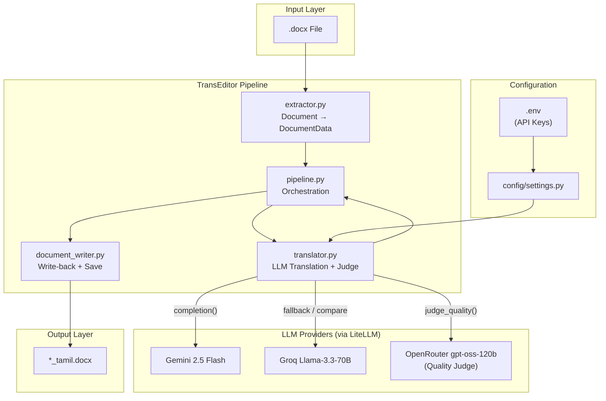

## System Architecture

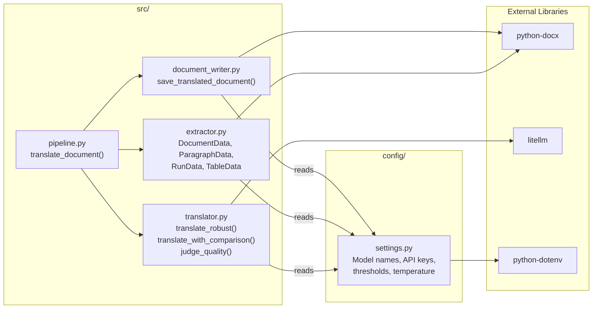

---

## Technology Stack — Complete Breakdown

| Technology / Package | Version | Category | Purpose in Project | Why Chosen | Key Features Used |
|---|---|---|---|---|---|
| **litellm** | `>=1.0.0` (notebook shows `1.88.1` installed) | LLM Client | Unified `.completion()` interface across Gemini, Groq, and OpenRouter | One API surface instead of three separate SDKs; native `fallbacks` parameter gives failover for free | `litellm.completion()`, `fallbacks=[{"model": ...}]`, model string routing (`gemini/...`, `groq/...`, `openrouter/...`) |
| **python-docx** | `>=1.1.0` | Document Processing | Read and write `.docx` files as Python objects (`Document`, `Paragraph`, `Run`, `Table`) | Only mature, actively maintained library for `.docx` manipulation in Python; gives direct XML-backed object access needed for in-place formatting preservation | `Document()`, `doc.paragraphs`, `doc.tables`, `para.runs`, `run.bold/italic/underline`, `para._p.remove()`, `para.add_run()` |
| **python-dotenv** | `==1.0.1` | Configuration | Loads `GEMINI_API_KEY`, `GROQ_API_KEY`, `OPENROUTER_API_KEY` from `.env` into `os.environ` | 12-factor-app config pattern — keeps secrets out of source code and version control (`.env` is gitignored) | `load_dotenv()` |
| **ipykernel** | `==6.29.5` | Dev Tooling | Jupyter kernel support for interactive development/demo | Needed to run `notebooks/translation_demo.ipynb` | Kernel registration for VS Code / JupyterLab |
| **jupyter** | `==1.1.1` | Dev Tooling | Notebook environment for exploratory testing of the translation pipeline | Fast iteration loop when prototyping prompts and comparing model output before wiring into `src/` | Notebook execution, inline output |
| **logging** (stdlib) | — | Observability | Structured `INFO`-level logs across extraction, translation, and write-back stages | Standard library, zero extra dependency, timestamped and leveled unlike `print()` | `logging.basicConfig()`, module-level `logger = logging.getLogger(__name__)` |
| **re** (stdlib) | — | Parsing | Extracts the JSON object out of the judge model's raw text response | LLMs frequently wrap JSON in prose or markdown fences; a greedy `\{.*\}` regex reliably isolates the payload | `re.search(r'\{.*\}', raw, re.DOTALL)` |
| **json** (stdlib) | — | Parsing | Parses the judge's extracted JSON into a Python dict | Native, no extra dependency | `json.loads()` |
| **pathlib** (stdlib) | — | File Handling | Builds the `_tamil.docx` output filename from the input path | Cross-platform path manipulation (Windows/Linux) without manual string splitting | `Path.stem`, `Path.suffix`, `Path.parent`, `Path.exists()` |

> *No frontend, database, authentication, or deployment/CI tooling exists in this codebase — TransEditor is a library invoked directly from Python (notebook or script), not a served application. Those sections are intentionally omitted below rather than fabricated.*

---

## Pipeline Lifecycle Trace

### Trace 1 — `translate_document()` with judge enabled (`use_judge=True`, the default)

```
1. ENTRY POINT
   └── translate_document(input_path, output_path=None, use_judge=True)
       → src/pipeline.py

2. EXTRACTION
   └── extract_document(input_path)   [src/extractor.py]
       → Document(path) opens and unzips the .docx (python-docx)
       → doc.paragraphs → _extract_paragraph() for each
           → _extract_runs() captures text + bold/italic/underline per run
       → doc.tables → _extract_table() for each
           → walks table.rows / row.cells / cell.paragraphs
       → Returns DocumentData(doc_ref, paragraphs=[ParagraphData...], tables=[TableData...])

3. PARAGRAPH TRANSLATION LOOP (per paragraph)
   └── For each ParagraphData in doc_data.paragraphs:
       → Skip if text is empty or shorter than MIN_TEXT_LENGTH (3 chars)
       → translate_with_comparison(text)   [src/translator.py]
           → Calls litellm.completion(model=GEMINI_MODEL, ...)   → gemini_result
           → Calls litellm.completion(model=GROQ_MODEL, ...)     → groq_result
           → Guard clauses check for failures:
               • both failed        → best = "ERROR: Models failed."
               • only gemini failed → best = groq_result (judge bypassed)
               • only groq failed   → best = gemini_result (judge bypassed)
               • both succeeded     → judge_quality(text, gemini_result, groq_result)
                   → litellm.completion(model=OPENROUTER_JUDGE_MODEL, temperature=0.0)
                   → regex-extracts JSON, json.loads() it
                   → best_score = max(gemini_score, groq_score)
                   → flagged = best_score < QUALITY_THRESHOLD (75)
                   → best = groq_result if recommended == "groq" else gemini_result
       → Appends result["best"] to para_translations
       → If judge flagged the result, appends details to `flagged` list

4. TABLE TRANSLATION LOOP (per cell paragraph)
   └── For each (table_idx, row, col, para_idx) cell paragraph:
       → translate_robust(text)   [src/translator.py]
           → litellm.completion(model=GEMINI_MODEL, fallbacks=[{"model": GROQ_MODEL}])
           → LiteLLM auto-retries on Groq if Gemini throws (e.g. 503)
       → Stores translation keyed by (table_idx, row, col, para_idx)

5. WRITE-BACK
   └── save_translated_document(doc_data, para_translations, table_translations,
                                  original_path, output_path)   [src/document_writer.py]
       → _apply_paragraph_translations(): for each paragraph, calls
         _replace_paragraph_text() — removes all existing <w:r> run elements
         and inserts a single new run carrying the Tamil text with the
         original paragraph's bold/italic/underline copied over
       → _apply_table_translations(): same replacement, keyed by
         (table_idx, row, col, para_idx)
       → Auto-derives output path: report.docx → report_tamil.docx
         (via config.settings.OUTPUT_SUFFIX)
       → doc_data.doc_ref.save(output_path)
       → PermissionError (file open in Word) is caught and re-raised as a
         clear RuntimeError instead of a raw OS exception

6. RETURN
   └── {"output_path", "para_count", "table_count", "flagged", "comparisons"}
```

### Trace 2 — `translate_document()` with judge disabled (`use_judge=False`)

```
Same as Trace 1, except step 3 calls translate_robust(text) directly for
paragraphs too (same call used for tables) — no dual-model comparison, no
judge call, no `flagged`/`comparisons` population. This is the faster,
cheaper path when quality arbitration isn't needed.
```

---

## Data Flow Explanation

**Extraction → Translation → Write-back**, with data changing shape at each layer:

1. **Disk → Live Object** (`extractor.py`): The raw `.docx` binary is unzipped and parsed by `python-docx` into a live `Document` object. TransEditor then walks that object graph *once* and produces a parallel, flattened snapshot (`DocumentData`) — every paragraph and table cell becomes a `ParagraphData` holding both the translatable string (`full_text`) and a **live reference** (`para_ref`) back into the original `Document` object. This dual representation is the key design choice: translation logic never touches `python-docx` objects directly, but write-back can still mutate the *original* document in place.

2. **Live Object → Flat Strings** (`pipeline.py`): Each `ParagraphData.full_text` is pulled out and sent independently to the translator. Table cells are additionally keyed by `(table_idx, row, col, para_idx)` so the exact grid position survives the round trip through the LLM layer, which only ever sees plain strings.

3. **Flat Strings → LLM → Flat Strings** (`translator.py`): Text goes out over HTTPS via LiteLLM to Gemini/Groq/OpenRouter and comes back as plain translated text (or, for the judge, a JSON verdict). No formatting data crosses this boundary at all — formatting is reattached afterward, not preserved through the LLM call.

4. **Flat Strings → Live Object → Disk** (`document_writer.py`): Translated strings are matched back to their originating `ParagraphData.para_ref`. `_replace_paragraph_text()` deletes all existing `<w:r>` run XML elements under that paragraph and inserts one new run carrying the Tamil text, with `bold`/`italic`/`underline` copied from the *first original run* of that paragraph. The mutated `Document` object is then serialized back to a new `.docx` file on disk.

**Error propagation**: A failure at any stage raises a typed exception (`FileNotFoundError`, `ValueError`, `RuntimeError`) rather than failing silently. `translate_with_comparison()` additionally *degrades* rather than raising — a failed model call becomes an `"[X failed: ...]"` string that flows through the pipeline and gets recorded in `flagged`, so one bad API call doesn't abort translation of the rest of the document.

---

<details>
<summary>UML Diagram Suite</summary>

### 1. Class Diagram

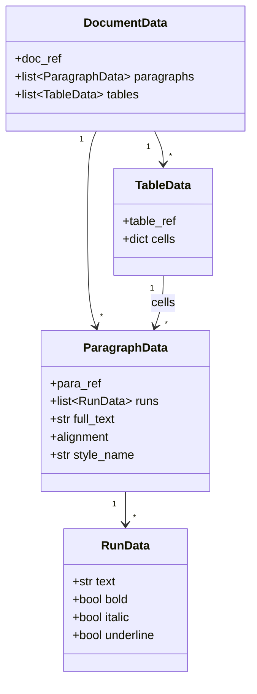

### 2. Sequence Diagram — Translate With Judge

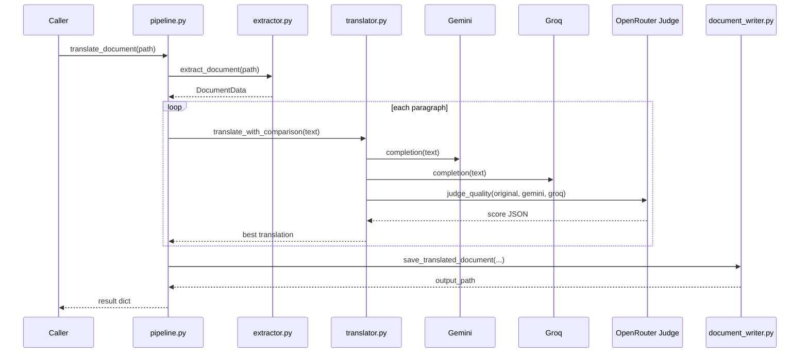

### 3. Activity Diagram — Judge Decision Flow

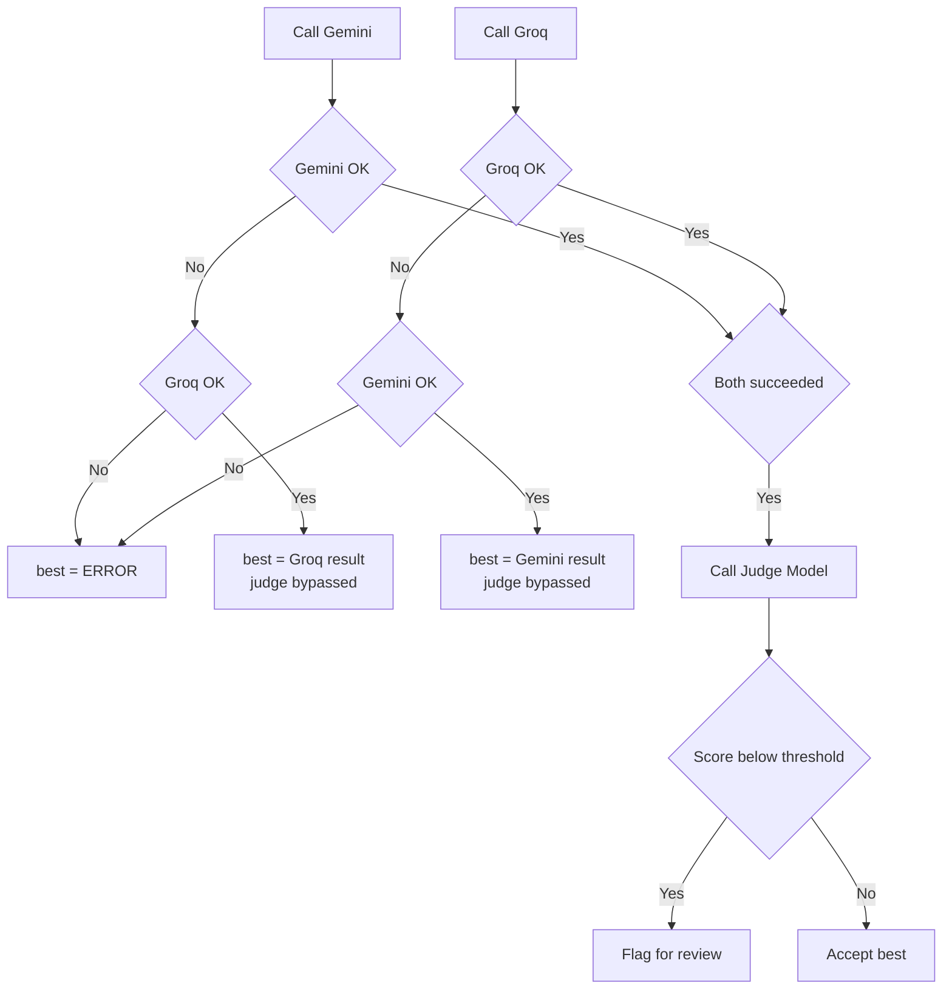

### 4. Component Diagram

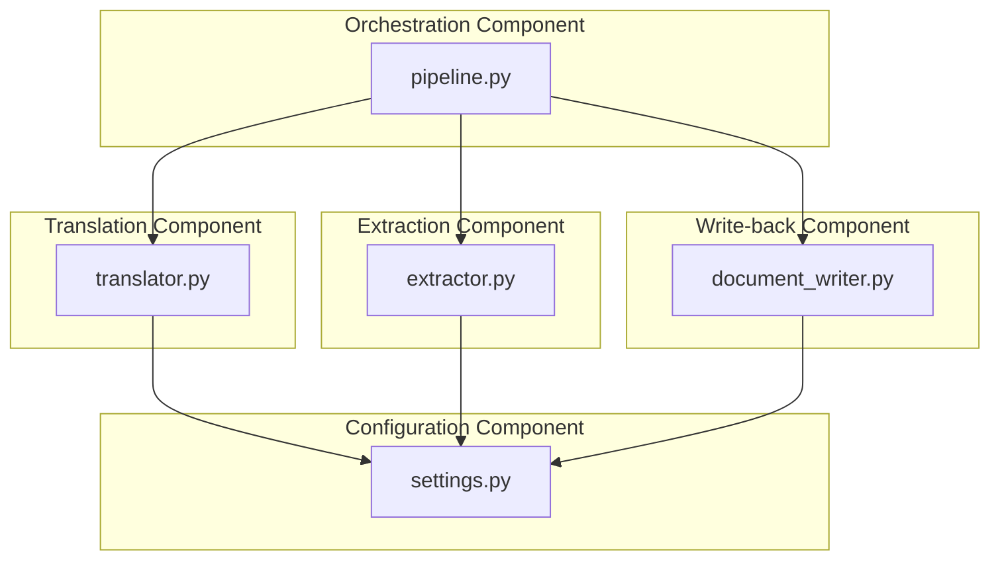

### 5. Package Diagram

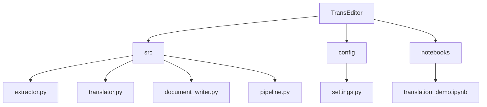

### 6. State Diagram — Per-Paragraph Translation State

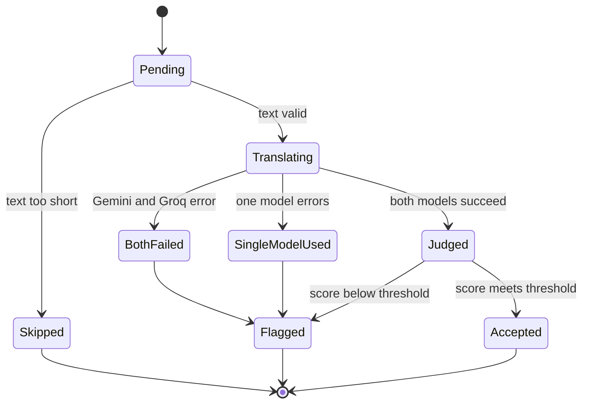

### 7. Use Case Diagram

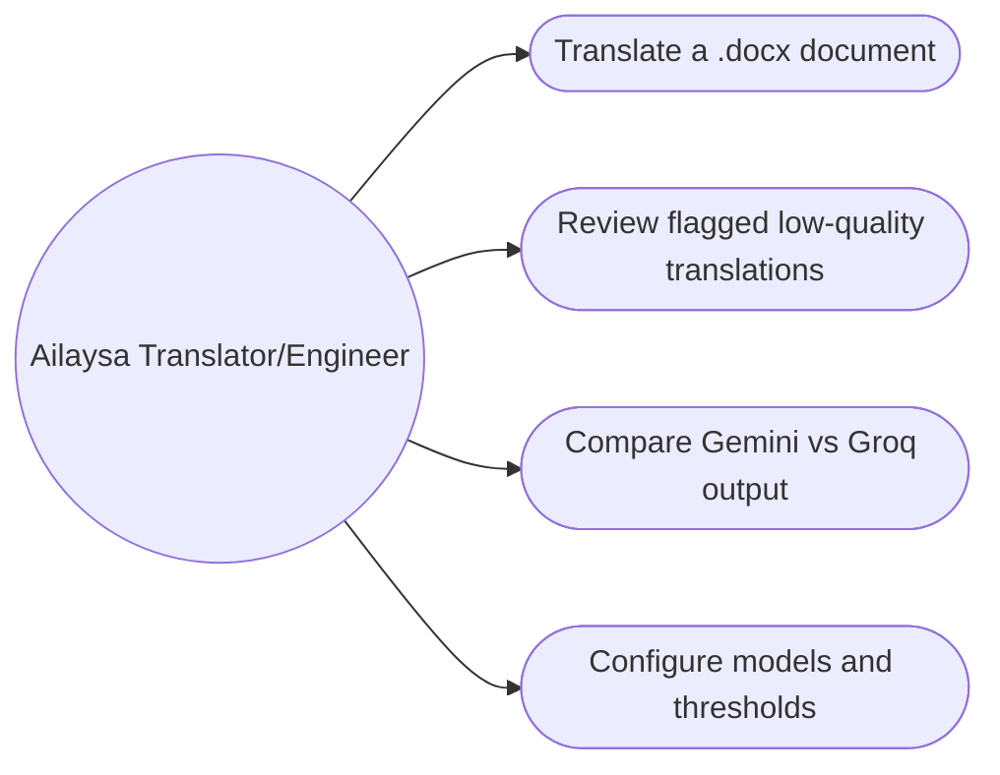

### 8. Deployment Diagram

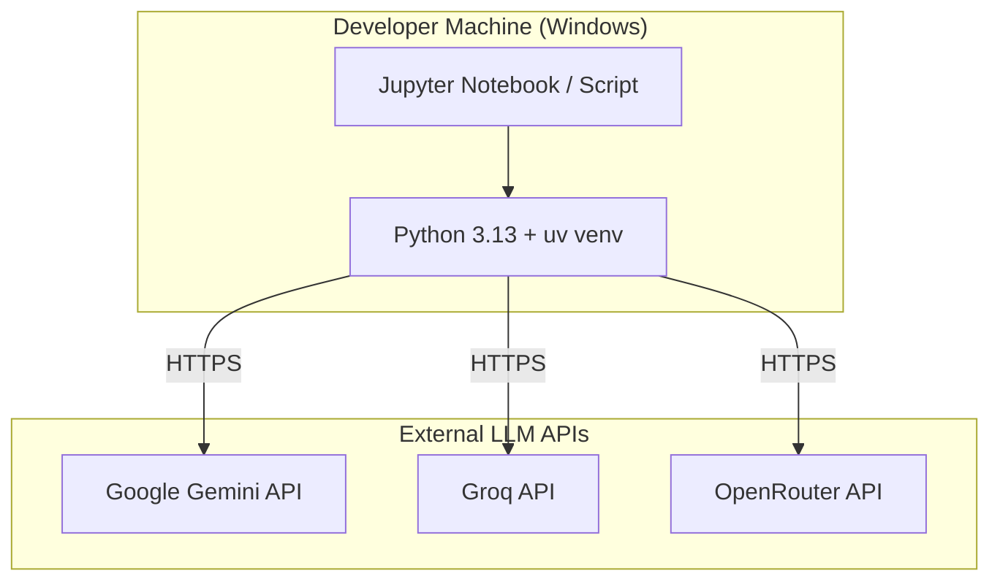

### 9. Swimlane — End-to-End Translation Ownership

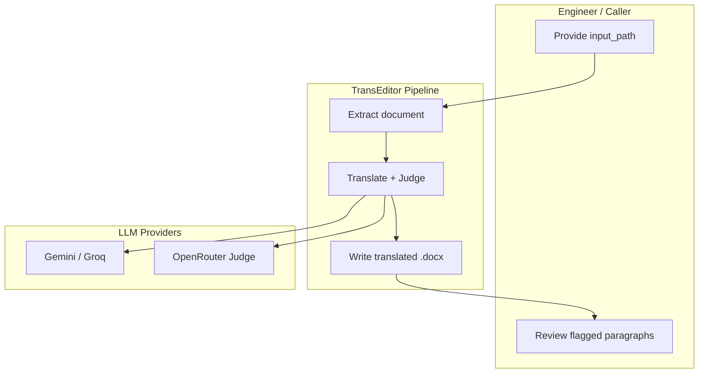

</details>

---

<details>
<summary>Data Flow Diagrams</summary>

### DFD Level 0 — Context

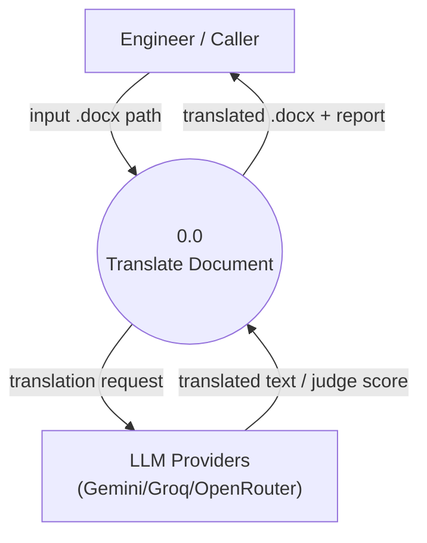

### DFD Level 1 — System

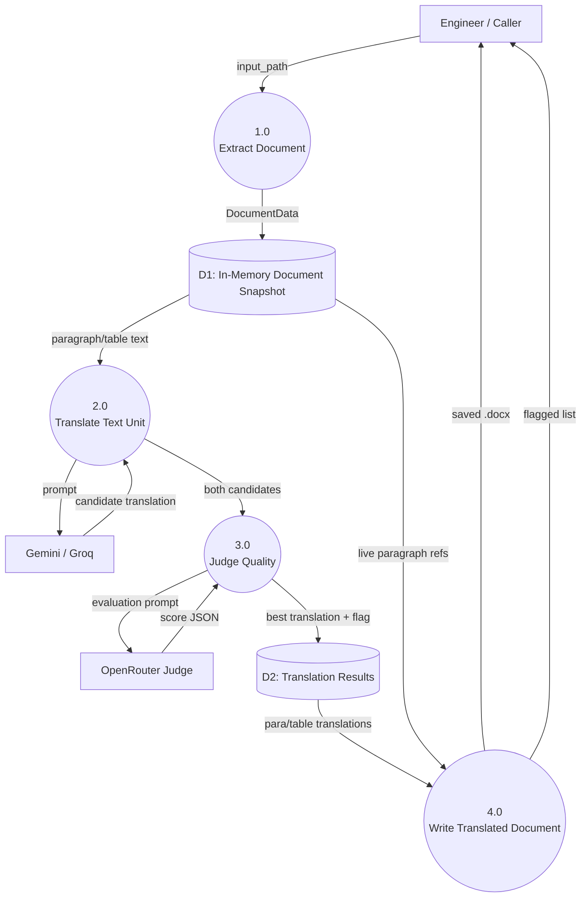

</details>

---

##  Folder Structure

```
TransEditor/
├── config/
│   └── settings.py          # Loads .env, defines model names, thresholds, temperature
├── notebooks/
│   └── translation_demo.ipynb  # Interactive demo / scratchpad for testing translation calls
├── src/
│   ├── extractor.py          # .docx → DocumentData (paragraphs + tables + formatting)
│   ├── translator.py         # LLM calls: translate_robust, translate_with_comparison, judge_quality
│   ├── document_writer.py    # DocumentData + translations → saved translated .docx
│   └── pipeline.py           # translate_document() — orchestrates the full flow
├── .env                      # API keys (gitignored — never committed)
├── .gitignore
└── requirements.txt          # litellm, python-docx, python-dotenv, jupyter, ipykernel
```

---

##  Prerequisites

- Python 3.13 (project's `.venv` is built against `cp313`)
- [uv](https://github.com/astral-sh/uv) (used in the documented install/run commands) — `pip` works too
- API keys for at least one of: Google Gemini, Groq. An OpenRouter key is required only if `use_judge=True`.

---

##  Installation

```bash
# 1. Clone / enter the project
cd TransEditor

# 2. Create and activate a virtual environment
uv venv
.venv\Scripts\activate        # Windows
# source .venv/bin/activate   # macOS/Linux

# 3. Install dependencies
uv pip install -r requirements.txt

# 4. Create your .env file
copy nul .env                 # Windows
# touch .env                  # macOS/Linux
```

Populate `.env`:

```env
GEMINI_API_KEY=your_gemini_key_here
GROQ_API_KEY=your_groq_key_here
OPENROUTER_API_KEY=your_openrouter_key_here
```

---

##  Environment Variables

| Variable | Required | Used By | Purpose |
|---|---|---|---|
| `GEMINI_API_KEY` | Yes (unless only using Groq) | `translator.py` via `settings.py` | Auth for Gemini 2.5 Flash translation calls |
| `GROQ_API_KEY` | Yes (unless only using Gemini) | `translator.py` via `settings.py` | Auth for Groq Llama-3.3-70B translation calls (also the fallback target) |
| `OPENROUTER_API_KEY` | Only if `use_judge=True` | `translator.py` via `settings.py` | Auth for the OpenRouter-hosted judge model that arbitrates Gemini vs Groq quality |

---

##  Configuration Guide (`config/settings.py`)

| Setting | Default | Purpose |
|---|---|---|
| `GEMINI_MODEL` | `gemini/gemini-2.5-flash` | LiteLLM model string for the primary translator |
| `GROQ_MODEL` | `groq/llama-3.3-70b-versatile` | LiteLLM model string for the secondary translator / fallback |
| `OPENROUTER_JUDGE_MODEL` | `openrouter/openai/gpt-oss-120b:free` | Model used to score Gemini vs Groq output |
| `TEMPERATURE` | `0.1` | Low temperature for consistent, literal translation (not creative) |
| `MAX_TOKENS` | `1024` | Cap on translation response length per text unit |
| `SOURCE_LANGUAGE` / `TARGET_LANGUAGE` | `English` / `Tamil` | Injected into the system prompt — changeable to retarget the pipeline to another language pair |
| `MIN_TEXT_LENGTH` | `3` | Paragraphs/cells shorter than this are passed through untranslated (skips empty runs, bullet glyphs, etc.) |
| `QUALITY_THRESHOLD` | `75` | Minimum judge score (0–100) below which a translation is flagged for manual review |
| `OUTPUT_SUFFIX` | `_tamil` | Appended to the output filename: `report.docx` → `report_tamil.docx` |

---

##  Module API Reference

Since TransEditor is a library (no HTTP API), the public surface is these functions:

| Function | Module | Signature | Returns |
|---|---|---|---|
| `extract_document` | `extractor.py` | `extract_document(filepath: str) -> DocumentData` | Structure-preserving snapshot of the `.docx` |
| `translate_robust` | `translator.py` | `translate_robust(text: str) -> str` | Single translated string, with automatic Gemini→Groq fallback |
| `translate_with_comparison` | `translator.py` | `translate_with_comparison(text: str) -> dict` | `{original, gemini, groq, judge, best}` |
| `judge_quality` | `translator.py` | `judge_quality(original, gemini_output, groq_output) -> dict` | `{gemini_score, groq_score, recommended, reason, flagged, raw_response}` |
| `save_translated_document` | `document_writer.py` | `save_translated_document(doc_data, para_translations, table_translations, original_path, output_path=None) -> str` | Path of the saved translated `.docx` |
| `translate_document` | `pipeline.py` | `translate_document(input_path, output_path=None, use_judge=True) -> dict` | `{output_path, para_count, table_count, flagged, comparisons}` — the main entry point |

**Basic usage:**

```python
from src.pipeline import translate_document

result = translate_document("report.docx", use_judge=True)

print(result["output_path"])   # report_tamil.docx
print(len(result["flagged"]))  # paragraphs that need manual review
```

---

##  Error Handling Strategy

| Failure | Where | Behavior |
|---|---|---|
| File doesn't exist | `extract_document()` | Raises `FileNotFoundError` immediately |
| Wrong file type | `extract_document()` | Raises `ValueError` before attempting to parse |
| Corrupt/unreadable `.docx` | `extract_document()` | `python-docx` exception wrapped into a clear `RuntimeError` |
| Text too short to translate | `translate_robust()` / `translate_with_comparison()` | Raises `ValueError` — caller (`pipeline.py`) guards against this by skipping short text before calling |
| Gemini fails, Groq available | `translate_robust()` | Silent LiteLLM fallback — no exception surfaces |
| Both models fail | `translate_robust()` | Raises `RuntimeError("All translation models failed...")` |
| One or both models fail during comparison | `translate_with_comparison()` | Never raises — degrades to single-model result or an `"ERROR: Models failed."` string, always flagged |
| Judge returns non-JSON or malformed JSON | `judge_quality()` | Caught, logged to console as `[CRITICAL]`, returns a safe default dict with `flagged=True` instead of crashing the pipeline |
| Output file open in Word | `save_translated_document()` | `PermissionError` caught and re-raised as a human-readable `RuntimeError` telling the user to close the file |

## 📋 Logging Strategy

All three core modules (`extractor.py`, `document_writer.py`, `pipeline.py`) configure a shared `INFO`-level logger via `logging.basicConfig()`, formatted as `%(asctime)s [%(name)s] %(levelname)s: %(message)s`. This surfaces document-open events, paragraph/table extraction counts, per-paragraph translation progress, and save confirmations without relying on `print()`. `translator.py` uses a plain `print()` only for the judge's `[CRITICAL]` failure path — a candidate for migrating to the shared logger.

---

## Engineering Decisions and Tradeoffs

- **Snapshot-then-mutate over streaming XML edits**: `extract_document()` builds a full `DocumentData` snapshot (with live `python-docx` object references) before any translation happens, rather than translating and rewriting paragraph-by-paragraph in a single pass. This trades a bit of upfront memory for a clean separation between "what needs translating" (flat strings) and "how to write it back" (live object graph) — translation logic never needs to know anything about `python-docx`.
- **Run collapsing on write-back**: `_replace_paragraph_text()` deletes *all* existing runs in a paragraph and inserts one new run, copying formatting from only the *first* original run. This is a deliberate simplification — a paragraph with multiple differently-formatted runs (e.g. "partly **bold**, partly not") will lose that per-run distinction after translation. Documented as a known limitation rather than silently mishandled.
- **Dual-model + judge is opt-in, not mandatory**: `translate_document(use_judge=True)` is the default, but `translate_robust()` (fallback-only, no judge) exists as a cheaper, faster path for tables and for when quality arbitration isn't worth the extra 3 API calls per text unit.
- **Guard-clause state machine over try/except pyramids**: `translate_with_comparison()` explicitly enumerates all four success/failure combinations of the two models rather than nesting try/excepts, making every code path traceable and testable independently.
- **Regex-first JSON extraction**: LLM judge responses aren't always clean JSON (models sometimes wrap output in prose or code fences). `re.search(r'\{.*\}', raw, re.DOTALL)` pulls out the first `{...}` block greedily before handing off to `json.loads()`, which is more robust than requiring a strict JSON-only response format.

---

##  Troubleshooting Guide

| Symptom | Likely Cause | Fix |
|---|---|---|
| `RuntimeError: All translation models failed` | Both `GEMINI_API_KEY` and `GROQ_API_KEY` missing, invalid, or both providers down | Check `.env` is populated and loaded (`load_dotenv()` runs at import time); verify keys are active |
| `RuntimeError: Cannot save to ...` | Output `.docx` is open in Microsoft Word | Close the file in Word, re-run |
| Judge always flags everything | `OPENROUTER_API_KEY` missing/invalid, or judge model consistently returns non-JSON | Check `[CRITICAL] Judge failed: ...` console output for the underlying error |
| Formatting looks flattened after translation | Paragraph originally had multiple runs with mixed formatting | Known limitation — `_replace_paragraph_text()` only preserves the first run's formatting |
| `ValueError: Length mismatch` in `document_writer.py` | `para_translations` list doesn't match `doc_data.paragraphs` length | Don't reorder/filter `doc_data.paragraphs` between extraction and write-back — indices must stay aligned |

